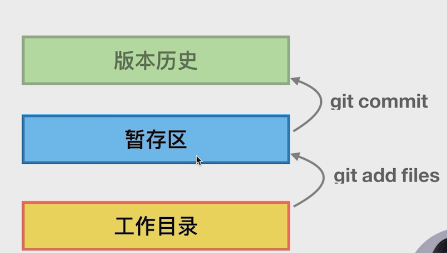
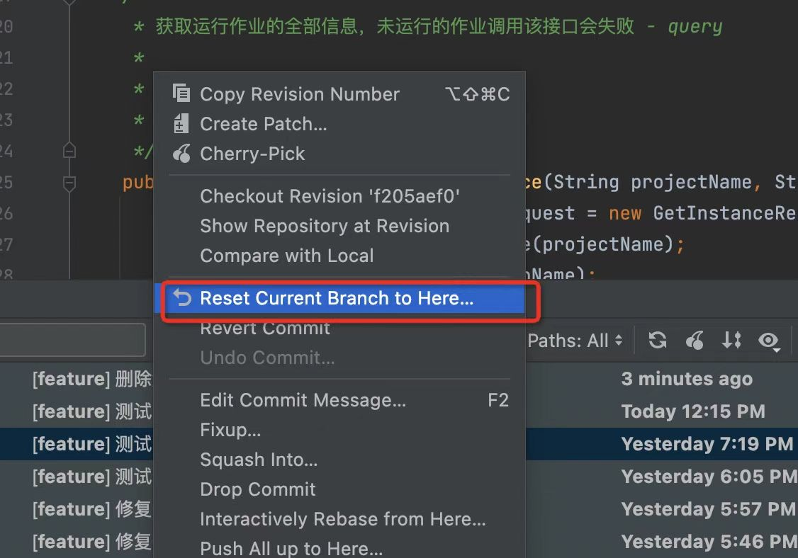
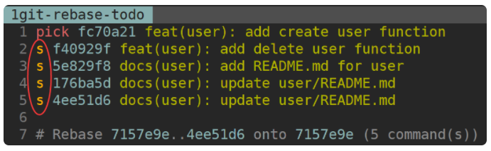
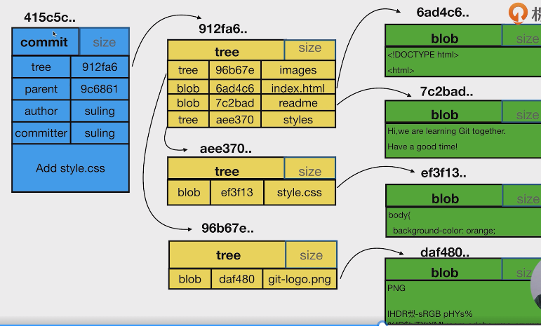

# git

## 1.官方资料
[官方文档](https://git-scm.com/book/zh/v2)

## 2. 三方-git学习资料

### [Git 的奇技淫巧](https://github.com/521xueweihan/git-tips)


### [ 如何写好一个git提交](https://zhuanlan.zhihu.com/p/27501055)

知乎搜到的一种民间格式

`[任务分类] 主要修改组件（可选）：修改内容`

开源格式
`<type>(<scope>): <subject><BLANK LINE><body><BLANK LINE><footer>`
诸如： docs(changelog): update change log to beta.5 中：
- docs(changelog): update change log to beta.5 中：

- docs 则对应修改的类型
- changelog 则是影响的范围
- subject 则是对应做的事件

对应的类型有：

- build: 影响构建系统或外部依赖关系的更改（示例范围：gulp，broccoli，npm）
- ci: 更改我们的持续集成文件和脚本（示例范围：Travis，Circle，BrowserStack，SauceLabs）
- docs: 仅文档更改
- feat: 一个新功能
- fix: 修复错误
- perf: 改进性能的代码更改
- refactor: 代码更改，既不修复错误也不添加功能
- style: 不影响代码含义的变化（空白，格式化，缺少分号等）
- test: 添加缺失测试或更正现有测试

## 3. 常用命令

- ###  git --version       查看当前git版本
- ###  git config
```xml
git config --list 查看git配置信息 ,可通过local system global参数查看不同域下的配置参数

git 初始化时配置个人提交信息
git config --global user.name "John Doe"
git config --global user.email johndoe@example.com
```
- ###  git init 初始化git仓库


- ###  git add [file_name] 将文件加入暂存区
    `git add a.txt`
- ###  git status          查看文件暂存区的变化
```
On branch master

No commits yet

Changes to be committed:
  (use "git rm --cached <file>..." to unstage)
        new file:   a.txt
```
- ###  git commit -m 'message'  提交
```xml
[master (root-commit) 6bce0b5] init it rep
 1 file changed, 0 insertions(+), 0 deletions(-)
 create mode 100644 a.txt
```
- ###  git log  查看git日志
```yaml
commit 6bce0b5ab41840dfc61d310b642f7761506a21be (HEAD -> master)
Author: SUNMENGJIE <ustcsunmengjie@163.com>
Date:   Mon Apr 18 22:09:14 2022 +0800

    commit message
```
- ###  git fetch

- ###  git branch -a 可以查看远程所有的分支


新建github仓库 未创建远程分支
- 新建分支并绑定远程分支

`git push -u origin master`

## 4. 日常使用中的特殊场景及解决方案
### 4.1 撤回push记录
step 1 ：idea中查看分支历史

step 2 ：reset(hard)

step 3 : git push -f 强制push

### 4.2 撤回commit
`git reset --soft HEAD^`

### 4.3 撤回merge
`git merge --abort`

### 4.4 连续多个commit合并
- step1 查看分支日志
```yaml
$ git log --oneline
4ee51d6 docs(user): update user/README.md
176ba5d docs(user): update user/README.md
5e829f8 docs(user): add README.md for user
f40929f feat(user): add delete user function
fc70a21 feat(user): add create user function
7157e9e docs(docs): append test line 'update3' to README.md
5a26aa2 docs(docs): append test line 'update2' to README.md
55892fa docs(docs): append test line 'update1' to README.md
89651d4 docs(doc): add README.md
```
- step2 基于rebase 进行commit合并
```yaml
git rebase -t <父commit号>   如合并4ee51d6 至 f40929f 父commit号为fc70a21

进入编辑页面 会有命令提示
根据提示将pick修改为s 即可
```


修改 commit msg
至此本地合并完毕
- step3 强制push到远端
`git push -f`

## 5. git 文件结构
