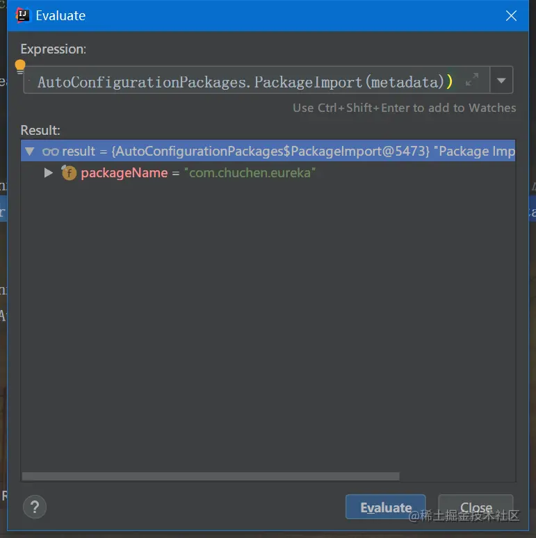
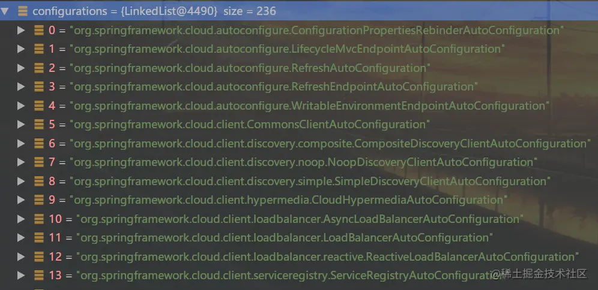
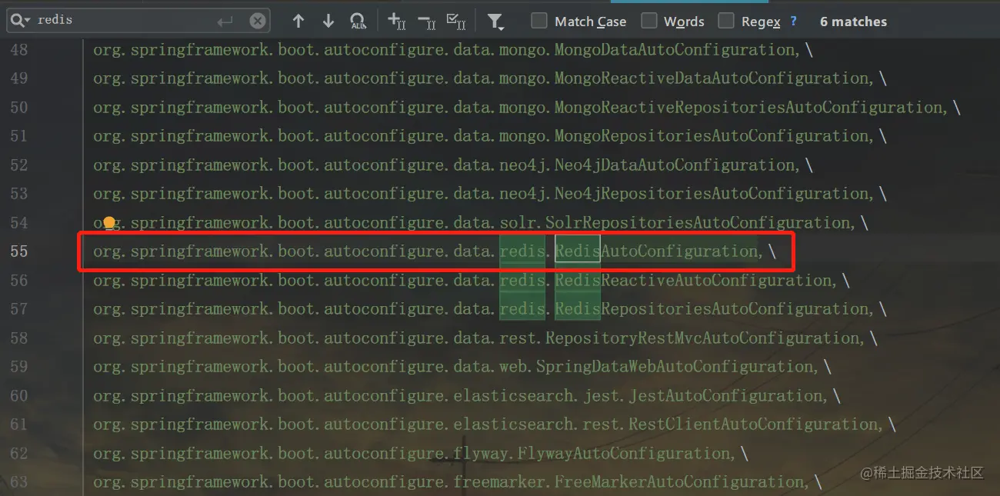
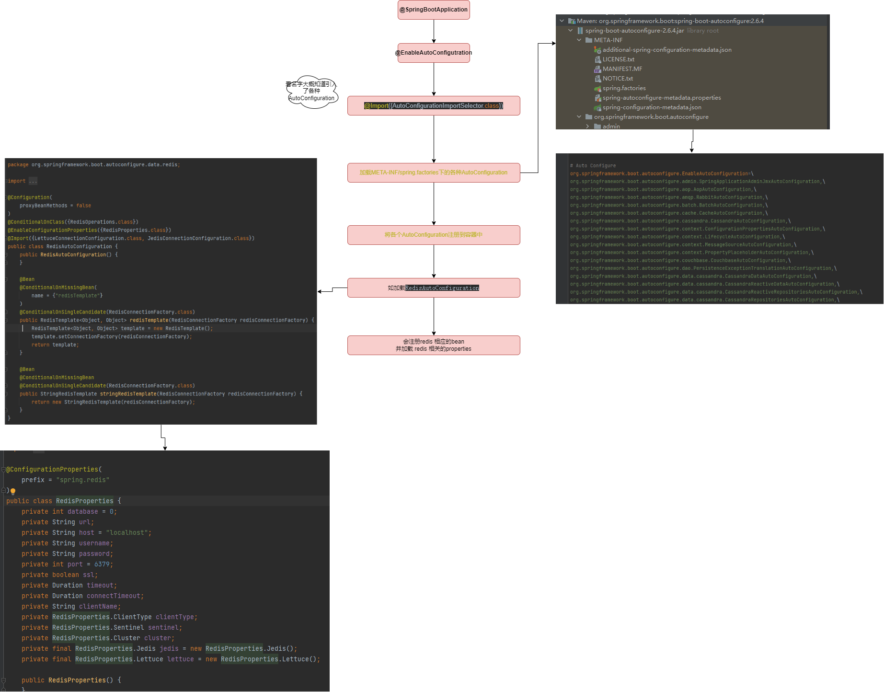

# SpringBoot自动装配

## 1.从@SpringBootApplication入手
通常springboot project 都会引入下面类似的代码
```java
@SpringBootApplication
public class DemApplication {

    public static void main(String[] args) {
        SpringApplication.run(DemApplication.class, args);
    }

}
```
其中@SPringBootApplication如下
```java
@Target({ElementType.TYPE})
@Retention(RetentionPolicy.RUNTIME)
@Documented
@Inherited
@SpringBootConfiguration
@EnableAutoConfiguration
@ComponentScan(
    excludeFilters = {@Filter(
    type = FilterType.CUSTOM,
    classes = {TypeExcludeFilter.class}
), @Filter(
    type = FilterType.CUSTOM,
    classes = {AutoConfigurationExcludeFilter.class}
)}
)
public @interface SpringBootApplication {
```
## 2. @SpringBootConfiguration
```java
@Target({ElementType.TYPE})
@Retention(RetentionPolicy.RUNTIME)
@Documented
@Configuration
@Indexed
public @interface SpringBootConfiguration {
```
由此可见该注解 就约等于 @Configuration 可实现bean的配置和注册

## 3. @ComponentScan
```java
@Retention(RetentionPolicy.RUNTIME)
@Target({ElementType.TYPE})
@Documented
@Repeatable(ComponentScans.class)
public @interface ComponentScan {
    @AliasFor("basePackages")
    String[] value() default {};
```
非今天重点，看名字就知道他的作用就是扫描包下面的bean

## 4.@EnableAutoConfiguration 今天的重点
```java
@Target({ElementType.TYPE})
@Retention(RetentionPolicy.RUNTIME)
@Documented
@Inherited
@AutoConfigurationPackage
@Import({AutoConfigurationImportSelector.class})
public @interface EnableAutoConfiguration {
    String ENABLED_OVERRIDE_PROPERTY = "spring.boot.enableautoconfiguration";

    Class<?>[] exclude() default {};

    String[] excludeName() default {};
}
```
这里重要的注解有两个，分别是@AutoConfigurationPackage和@Import
### 4.1 @AutoConfigurationPackage
```java
@Target({ElementType.TYPE})
@Retention(RetentionPolicy.RUNTIME)
@Documented
@Inherited
@Import({Registrar.class})
public @interface AutoConfigurationPackage {
}
```
这里发现他使用@Import注解引入了一个类Registrar
```java
static class Registrar implements ImportBeanDefinitionRegistrar, DeterminableImports {
    Registrar() {
    }

    public void registerBeanDefinitions(AnnotationMetadata metadata, BeanDefinitionRegistry registry) {
        AutoConfigurationPackages.register(registry, (new AutoConfigurationPackages.PackageImport(metadata)).getPackageName());
    }

    public Set determineImports(AnnotationMetadata metadata) {
        return Collections.singleton(new AutoConfigurationPackages.PackageImport(metadata));
    }
}
```
那么这个类是用来干嘛的呢？我们断点跟一下，看一下registerBeanDefinitions方法是做什么的。


这里发现new PackageImport(metadata).getPackageName()返回的返回了当前主程序类的同级以及子级的包组件。
这也证明了@ComponentScan默认扫描其所在类的package。

### 4.2 @Import({AutoConfigurationImportSelector.class})
```java
public String[] selectImports(AnnotationMetadata annotationMetadata) {
    if (!this.isEnabled(annotationMetadata)) {
        return NO_IMPORTS;
    } else {
        AutoConfigurationMetadata autoConfigurationMetadata = AutoConfigurationMetadataLoader.loadMetadata(this.beanClassLoader);
        AutoConfigurationImportSelector.AutoConfigurationEntry autoConfigurationEntry = this.getAutoConfigurationEntry(autoConfigurationMetadata, annotationMetadata);
        return StringUtils.toStringArray(autoConfigurationEntry.getConfigurations());
    }
}
```
这个方法调用了getAutoConfigurationEntry方法
```java
protected AutoConfigurationImportSelector.AutoConfigurationEntry getAutoConfigurationEntry(AutoConfigurationMetadata autoConfigurationMetadata, AnnotationMetadata annotationMetadata) {
    if (!this.isEnabled(annotationMetadata)) {
        return EMPTY_ENTRY;
    } else {
        AnnotationAttributes attributes = this.getAttributes(annotationMetadata);
        List configurations = this.getCandidateConfigurations(annotationMetadata, attributes);
        configurations = this.removeDuplicates(configurations);
        Set exclusions = this.getExclusions(annotationMetadata, attributes);
        this.checkExcludedClasses(configurations, exclusions);
        configurations.removeAll(exclusions);
        configurations = this.filter(configurations, autoConfigurationMetadata);
        this.fireAutoConfigurationImportEvents(configurations, exclusions);
        return new AutoConfigurationImportSelector.AutoConfigurationEntry(configurations, exclusions);
    }
}
```
这里我们重点看一下getCandidateConfigurations方法，先断点看一下方法的返回值


该方法返回的是需要实例化的类信息列表，有了他spring就可以通过类加载器将需要实例化的类加载到jvm中。
现在我们看一下该方法的代码，发现他是借用了SpringFactoriesLoader类的方法
```java
protected List getCandidateConfigurations(AnnotationMetadata metadata, AnnotationAttributes attributes) {
    List configurations = SpringFactoriesLoader.loadFactoryNames(this.getSpringFactoriesLoaderFactoryClass(), this.getBeanClassLoader());
    Assert.notEmpty(configurations, "No auto configuration classes found in META-INF/spring.factories. If you are using a custom packaging, make sure that file is correct.");
    return configurations;
}
```
再来看一下loadFactoryNames方法
```java
public static List loadFactoryNames(Class factoryClass, @Nullable ClassLoader classLoader) {
    String factoryClassName = factoryClass.getName();
    return (List)loadSpringFactories(classLoader).getOrDefault(factoryClassName, Collections.emptyList());
}

private static Map> loadSpringFactories(@Nullable ClassLoader classLoader) {
    MultiValueMap result = (MultiValueMap)cache.get(classLoader);
    if (result != null) {
        return result;
    } else {
        try {
            Enumeration urls = classLoader != null ? classLoader.getResources("META-INF/spring.factories") : ClassLoader.getSystemResources("META-INF/spring.factories");
            LinkedMultiValueMap result = new LinkedMultiValueMap();

            //....省略

            cache.put(classLoader, result);
            return result;
        } catch (IOException var13) {
            throw new IllegalArgumentException("Unable to load factories from location [META-INF/spring.factories]", var13);
        }
    }
}
```
发现他读取了一个名为spring.factories的文件


比如我们找一下redis的配置


点击去看一下
```java
@Configuration
@ConditionalOnClass({RedisOperations.class})
@EnableConfigurationProperties({RedisProperties.class})
@Import({LettuceConnectionConfiguration.class, JedisConnectionConfiguration.class})
public class RedisAutoConfiguration {
    ......
}
```
@ConditionalOnClass({RedisOperations.class})    表示必须存在RedisOperations这个类，否则不解析该注解修饰的配置类。

再看看RedisProperties这个类
```java
public class RedisProperties {
    private int database = 0;
    private String url;
    private String host = "localhost";
    private String password;
    private int port = 6379;
    private boolean ssl;
    private Duration timeout;
    private RedisProperties.Sentinel sentinel;
    private RedisProperties.Cluster cluster;
    private final RedisProperties.Jedis jedis = new RedisProperties.Jedis();
    private final RedisProperties.Lettuce lettuce = new RedisProperties.Lettuce();
    ......省略
}
```
是不是眼熟了！这个就是我们在使用redis时写在application.properties里面，需要配置redis的信息
对应的配置应为：
```java
spring.redis.host=127.0.0.1
spring.redis.port=6379   
spring.redis.timeout=0
spring.redis.password=
```
同时也可以看到redis默认为我们配置了host和port属性。所以在配置redis时，如果端口号围为默认的6379，我们也可以不写的原因。

# 5. 总结

