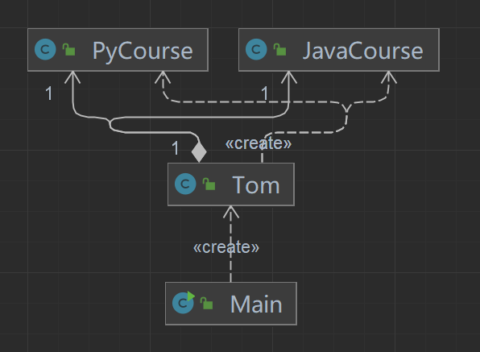
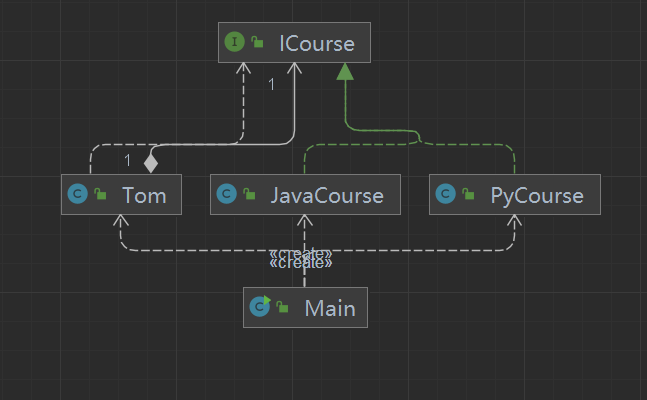
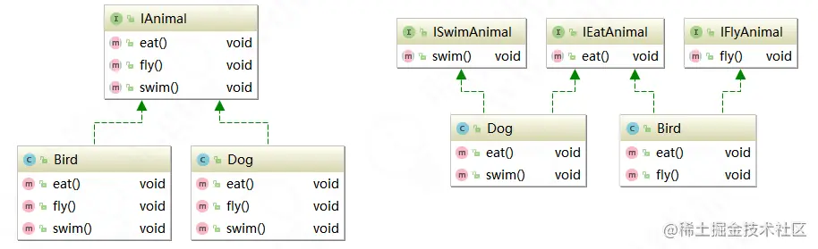

# 软件设计原则

## 1.开闭原则 (Open Close Principle) - 简称OCP 
```yaml
开闭原则（Open Closed Principle）是编程中最基础、最重要设计原则

一个软件实体如类，模块和函数应该对扩展开放(对提供方)，对修改关闭(对使用方)。用抽象构建框架，用实现扩展细节。

当软件需要变化时，尽量通过扩展软件实体的行为来实现变化，而不是通过修改已有的代码来实现变化。

编程中遵循其它原则，以及使用设计模式的目的就是遵循开闭原则。
```
举个[小栗子](https://www.jianshu.com/p/707906b7bd42) ，个人感觉不是很准确，将就着理解
另一个[小栗子](https://juejin.cn/post/7021511081919152141);

## 2.依赖倒置原则
```yaml
依赖倒置原则（Dependence Inversion Principle，DIP）
是指设计代码结构时，高层模块不应该依赖低层模块，二者都应该依赖其抽象。
抽象不应该依赖细节，细节应该依赖抽象。通过依赖倒置，可以减少类与类之间的耦合性，
提高系统的稳定性，提高代码的可读性和可维护性，并且能够降低修改程序所造成的风险。
```
举个[例子](https://juejin.cn/post/7021771674034896910)
类图 由左图 变为 右图
<table>
    <tr>
        <td>  </td>
        <td>  </td>
    </tr>
</table>

简单理解为 面向接口编程 而不是 面向实现编程

## 3.单一职责原则
```yaml
单一职责（Simple Responsibility Pinciple，SRP）
是指不要存在多于一个导致类变更的原因。假设我们有一个类负责两个职责，
一旦发生需求变更，修改其中一个职责的逻辑代码，有可能导致另一个职责的功能发生故障。
这样一来，这个类就存在两个导致类变更的原因。如何解决这个问题呢？将两个职责用两个类来实现，进行解耦。
后期需求变更维护互不影响。这样的设计，可以降低类的复杂度，提高类的可读性，提高系统的可维护性
，降低变更引起的风险。总体来说，就是一个类、接口或方法只负责一项职责。
```
举个 [例子](https://juejin.cn/post/7021809979287928839)

## 4.迪米特原则 又名 最少知道原则
```yaml
迪米特原则（Law of Demeter LoD）
是指一个对象应该对其他对象保持最少的了解，
又叫最少知道原则（Least Knowledge Principle，LKP），尽量降低类与类之间的耦合度。
迪米特原则主要强调：只和朋友交流，不和陌生人说话。出现在成员变量、方法的输入、输出参数中
的类都可以称为成员朋友类，而出现在方法体内部的类不属于朋友类。
```
举个[例子](https://juejin.cn/post/7021811523039281166)

## 5.接口隔离原则
```yaml
接口隔离原则（Interface Segregation Principle, ISP）是指用多个专门的接口，而不使用单一的总接口，
客户端不应该依赖它不需要的接口。这个原则指导我们在设计接口时应当注意以下几点：
（1）一个类对另一个类的依赖应该建立在最小的接口之上。
（2）建立单一接口，不要建立庞大臃肿的接口。
（3）尽量细化接口，接口中的方法尽量少（不是越少越好，一定要适度）。
接口隔离原则符合我们常说的高内聚、低耦合的设计思想，可以使类具有很好的可读性、可扩展性和可维护性。
我们在设计接口的时候，要多花时间去思考，要考虑业务模型，包括对以后有可能发生变更的地方还要做一些预
判。所以，对于抽象、对于业务模型的理解是非常重要的。
```
举个[例子](https://juejin.cn/post/7021810803120553998)
下图由左图 优化为 右图


## 6.里氏替换原则
```yaml
里氏替换原则（Liskov Substitution Principle，LSP）是指如果对每一个类型为T1的对象o1，都有类型为T2的对象O2，使得以T1定义的所有程序P在所有的对象O1都替换成O2时，程序P的行为没有发生变化，那么类型T2是类型T1的子类型。
这个定义看上去还是比较抽象的，我们重新理解一下。可以理解为一个软件实体如果适用于一个父类，那么一定适用于其子类，所有引用父类的地方必须能透明地使用其子类的对象，子类对象能够替换父类对象，而程序逻辑不变。根据这个理解，引申含义为：子类可以扩展父类的功能，但不能改变父类原有的功能。
（1）子类可以实现父类的抽象方法，但不能覆盖父类的非抽象方法。
（2）子类可以增加自己特有的方法。
（3）当子类的方法重载父类的方法时，方法的前置条件（即方法的输入/入参）要比父类方法的输入参数更宽松。
（4）当子类的方法实现父类的方法时（重写/重载或实现抽象方法），方法的后置条件（即方法的输出/返回值）要比父类更严格或与父类一样。
```
举个[例子](https://juejin.cn/post/7021811802707066887)

## 7.合成复用原则

```yaml
合成复用原则（Composite/Aggregate Reuse Principle，CARP）
是指尽量使用对象组合（has-a）/聚合（contanis-a）而不是继承关系达到软件复用的目的。可以使系统更加灵活
，降低类与类之间的耦合度，一个类的变化对其他类造成的影响相对较少。
继承叫作白箱复用，相当于把所有的实现细节暴露给子类。组合/聚合称为黑箱复用，我们是无法获取到类以外的对象
的实现细节的。虽然我们要根据具体的业务场景来做代码设计，但也需要遵循OOP模型。
```
举个[例子](https://juejin.cn/post/7021812167850590215)
