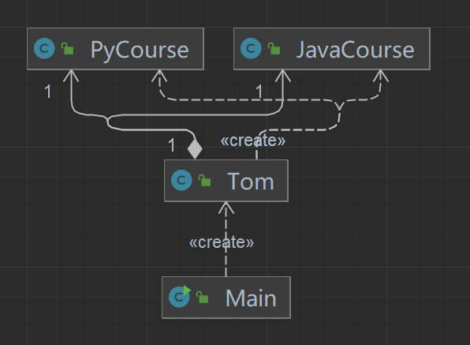

# 软件设计原则

## 1.开闭原则 (Open Close Principle) - 简称OCP 
```yaml
开闭原则（Open Closed Principle）是编程中最基础、最重要设计原则

一个软件实体如类，模块和函数应该对扩展开放(对提供方)，对修改关闭(对使用方)。用抽象构建框架，用实现扩展细节。

当软件需要变化时，尽量通过扩展软件实体的行为来实现变化，而不是通过修改已有的代码来实现变化。

编程中遵循其它原则，以及使用设计模式的目的就是遵循开闭原则。
```
举个[小栗子](https://www.jianshu.com/p/707906b7bd42) ，个人感觉不是很准确，将就着理解
另一个[小栗子](https://juejin.cn/post/7021511081919152141);

## 2.依赖倒置原则
```yaml
依赖倒置原则（Dependence Inversion Principle，DIP）
是指设计代码结构时，高层模块不应该依赖低层模块，二者都应该依赖其抽象。
抽象不应该依赖细节，细节应该依赖抽象。通过依赖倒置，可以减少类与类之间的耦合性，
提高系统的稳定性，提高代码的可读性和可维护性，并且能够降低修改程序所造成的风险。
```
举个[例子](https://juejin.cn/post/7021771674034896910)
类图 由左图 变为 右图
<table>
    <tr>
        <td>  </td>
        <td>  </td>
    </tr>
</table>

简单理解为 面向接口编程 而不是 面向实现编程

## 3.单一职责原则
```yaml
单一职责（Simple Responsibility Pinciple，SRP）
是指不要存在多于一个导致类变更的原因。假设我们有一个类负责两个职责，
一旦发生需求变更，修改其中一个职责的逻辑代码，有可能导致另一个职责的功能发生故障。
这样一来，这个类就存在两个导致类变更的原因。如何解决这个问题呢？将两个职责用两个类来实现，进行解耦。
后期需求变更维护互不影响。这样的设计，可以降低类的复杂度，提高类的可读性，提高系统的可维护性
，降低变更引起的风险。总体来说，就是一个类、接口或方法只负责一项职责。
```
举个 [例子](https://juejin.cn/post/7021809979287928839)

## 4.迪米特原则 又名 最少知道原则
```yaml
迪米特原则（Law of Demeter LoD）
是指一个对象应该对其他对象保持最少的了解，
又叫最少知道原则（Least Knowledge Principle，LKP），尽量降低类与类之间的耦合度。
迪米特原则主要强调：只和朋友交流，不和陌生人说话。出现在成员变量、方法的输入、输出参数中
的类都可以称为成员朋友类，而出现在方法体内部的类不属于朋友类。
```